# System Architecture Analysis

## Overview

- **Project**: /home/tom/github/semcod/regix
- **Primary Language**: python
- **Languages**: python: 24, shell: 1
- **Analysis Mode**: static
- **Total Functions**: 166
- **Total Classes**: 41
- **Modules**: 25
- **Entry Points**: 120

## Architecture by Module

### regix.benchmark
- **Functions**: 31
- **Classes**: 9
- **File**: `benchmark.py`

### regix.config
- **Functions**: 24
- **Classes**: 2
- **File**: `config.py`

### regix.smells
- **Functions**: 14
- **File**: `smells.py`

### regix.models
- **Functions**: 10
- **Classes**: 13
- **File**: `models.py`

### regix.git
- **Functions**: 9
- **Classes**: 1
- **File**: `git.py`

### regix.cli
- **Functions**: 8
- **File**: `cli.py`

### regix.backends.structure_backend
- **Functions**: 7
- **Classes**: 2
- **File**: `structure_backend.py`

### regix
- **Functions**: 6
- **Classes**: 1
- **File**: `__init__.py`

### regix.backends
- **Functions**: 6
- **Classes**: 1
- **File**: `__init__.py`

### regix.cache
- **Functions**: 5
- **File**: `cache.py`

### regix.backends.coverage_backend
- **Functions**: 5
- **Classes**: 1
- **File**: `coverage_backend.py`

### regix.exceptions
- **Functions**: 4
- **Classes**: 5
- **File**: `exceptions.py`

### regix.compare
- **Functions**: 4
- **File**: `compare.py`

### regix.history
- **Functions**: 4
- **File**: `history.py`

### regix.snapshot
- **Functions**: 4
- **File**: `snapshot.py`

### scripts.check_regression
- **Functions**: 3
- **File**: `check_regression.py`

### regix.report
- **Functions**: 3
- **File**: `report.py`

### regix.backends.architecture_backend
- **Functions**: 3
- **Classes**: 1
- **File**: `architecture_backend.py`

### regix.backends.radon_backend
- **Functions**: 3
- **Classes**: 1
- **File**: `radon_backend.py`

### regix.backends.docstring_backend
- **Functions**: 3
- **Classes**: 1
- **File**: `docstring_backend.py`

## Key Entry Points

Main execution flows into the system:

### regix.backends.architecture_backend.ArchitectureBackend.collect
- **Calls**: str, ast.walk, results.append, ast.parse, sum, len, getattr, max

### regix.benchmark.BenchmarkReporter.print_rich
- **Calls**: Console, console.print, console.print, suites.items, len, sum, sum, sum

### regix.models.RegressionReport.to_toon
> TOON format — machine-readable plain text.
- **Calls**: None.strftime, lines.append, lines.append, lines.append, lines.append, lines.append, lines.extend, lines.extend

### regix.cli.compare
> Compare metrics between two git refs or local state.
- **Calls**: app.command, typer.Argument, typer.Argument, typer.Option, typer.Option, typer.Option, typer.Option, typer.Option

### regix.cli.status
> Show Regix configuration and available backends.
- **Calls**: app.command, typer.Option, typer.Option, regix.cli._load_config, typer.echo, typer.echo, typer.echo, typer.echo

### regix.cli.diff
> Show symbol-by-symbol metric diff (like git diff for metrics).
- **Calls**: app.command, typer.Argument, typer.Argument, typer.Option, typer.Option, typer.Option, typer.Option, regix.cli._load_config

### regix.compare.compare
> Compare two snapshots and produce a regression report.
- **Calls**: time.monotonic, sorted, sum, sum, regix.smells.detect_smells, sum, sum, RegressionReport

### regix.cli.gates
> Check current state against configured quality gates (absolute thresholds).
- **Calls**: app.command, typer.Option, typer.Option, typer.Option, typer.Option, regix.cli._load_config, None.resolve, regix.snapshot.capture

### regix.benchmark.BackendProbe.run
- **Calls**: regix.backends.get_backend, Path, BenchmarkResult, backend.is_available, BenchmarkResult, tempfile.mkdtemp, self._generate_files, RegressionConfig

### regix.integrations.RegixCollector._parse
- **Calls**: path.read_text, text.splitlines, json.loads, line.strip, line.startswith, line.startswith, line.startswith, data.get

### regix.cli.snapshot
> Capture and store a snapshot without comparing.
- **Calls**: app.command, typer.Argument, typer.Option, typer.Option, typer.Option, typer.Option, regix.cli._load_config, None.resolve

### regix.cli.history
> Show metric timeline across N historical commits.
- **Calls**: app.command, typer.Option, typer.Option, typer.Option, typer.Option, typer.Option, typer.Option, typer.Option

### regix.backends.vallm_backend.VallmBackend.collect
> Run ``vallm batch`` and collect quality scores per file.
- **Calls**: self.is_available, subprocess.run, json.loads, set, isinstance, data.get, entry.get, entry.get

### scripts.check_regression.check_regression
> Main regression check function.
- **Calls**: scripts.check_regression.load_json_file, scripts.check_regression.load_json_file, scripts.check_regression.load_json_file, None.append, open, json.dump, regix.benchmark.BenchmarkReporter.print, sys.exit

### regix.backends.structure_backend.StructureBackend.collect
> Collect fan_out, call_count per function and symbol_count per file.
- **Calls**: str, self._collect_functions, results.append, ast.parse, SymbolMetrics, regix.backends.structure_backend._analyse_function, results.append, full.read_text

### regix.benchmark.BenchmarkReporter.print_plain
- **Calls**: suites.items, None.append, regix.benchmark.BenchmarkReporter.print, regix.benchmark.BenchmarkReporter.print, regix.benchmark.BenchmarkReporter.print, regix.benchmark.BenchmarkReporter.print, regix.benchmark.BenchmarkReporter.print, regix.benchmark.BenchmarkReporter.print

### regix.cache.lookup
> Return cached snapshot or None.
- **Calls**: regix.cache._cache_dir, regix.cache._cache_key, path.exists, None.decode, json.loads, Snapshot, SymbolMetrics, gzip.decompress

### regix.backends.radon_backend.RadonBackend.collect
> Collect MI (module-level) and CC (per-function) using radon.
- **Calls**: str, results.append, mi_visit, cc_visit, SymbolMetrics, results.append, full.read_text, SymbolMetrics

### regix.backends.docstring_backend.DocstringBackend.collect
> Compute docstring coverage per file.
- **Calls**: str, ast.walk, results.append, ast.parse, isinstance, SymbolMetrics, full.read_text, ast.get_docstring

### regix.benchmark.ImportProbe.run
- **Calls**: range, min, BenchmarkResult, time.perf_counter, BenchmarkResult, subprocess.run, times.append, time.perf_counter

### regix.benchmark.CLIProbe.run
- **Calls**: range, min, BenchmarkResult, time.perf_counter, BenchmarkResult, subprocess.run, times.append, time.perf_counter

### regix.benchmark.ThroughputProbe.run
- **Calls**: BenchmarkResult, self.setup, time.perf_counter, range, float, self.fn, time.perf_counter, BenchmarkResult

### regix.benchmark.main
- **Calls**: argparse.ArgumentParser, parser.add_argument, parser.add_argument, parser.add_argument, parser.add_argument, parser.parse_args, regix.benchmark.build_regix_suite, suite.run

### regix.config.RegressionConfig.from_dict
> Build config from a flat or nested dict.

Supports two config layouts:

**New (recommended)**::

    gates:
      hard:  {cc: 30, mi: 15, ...}
      t
- **Calls**: data.get, cls._parse_gates, cls._parse_legacy_metrics, cls._parse_deltas, cls._parse_smells, cls._parse_files, cls._parse_backends, cls._parse_output

### regix.backends.coverage_backend.CoverageBackend._from_coverage_file
- **Calls**: cov_lib.Coverage, cov.load, cov.get_data, data.measured_files, data.lines, len, results.append, str

### regix.benchmark.UnitTestProbe.run
- **Calls**: time.perf_counter, output.splitlines, BenchmarkResult, str, subprocess.run, None.strip, time.perf_counter, BenchmarkResult

### regix.benchmark.BackendProbe._generate_files
> Create synthetic Python files with various constructs.
- **Calls**: textwrap.dedent, max, range, int, template.format, fpath.write_text, files.append, len

### regix.git.checkout_temporary
> Context manager: create a git worktree at *ref* in a temp directory.

The original working tree is never modified.
Prefer :func:`read_tree_sources` fo
- **Calls**: Path, regix.git.resolve_ref, Path, tempfile.mkdtemp, regix.git._run_git, regix.git._run_git, tmp.exists, shutil.rmtree

### regix.models.Snapshot.load
> Deserialise from JSON.
- **Calls**: json.loads, cls, None.read_text, SymbolMetrics, data.get, data.get, datetime.fromisoformat, data.get

### regix.backends.coverage_backend.CoverageBackend._from_json
- **Calls**: data.get, file_data.items, json.loads, str, finfo.get, summary.get, path.read_text, results.append

## Process Flows

Key execution flows identified:

### Flow 1: collect
```
collect [regix.backends.architecture_backend.ArchitectureBackend]
```

### Flow 2: print_rich
```
print_rich [regix.benchmark.BenchmarkReporter]
```

### Flow 3: to_toon
```
to_toon [regix.models.RegressionReport]
```

### Flow 4: compare
```
compare [regix.cli]
```

### Flow 5: status
```
status [regix.cli]
  └─> _load_config
```

### Flow 6: diff
```
diff [regix.cli]
```

### Flow 7: gates
```
gates [regix.cli]
```

### Flow 8: run
```
run [regix.benchmark.BackendProbe]
  └─ →> get_backend
```

### Flow 9: _parse
```
_parse [regix.integrations.RegixCollector]
```

### Flow 10: snapshot
```
snapshot [regix.cli]
```

## Key Classes

### regix.config.RegressionConfig
> All user-configurable values for a Regix run.
- **Methods**: 35
- **Key Methods**: regix.config.RegressionConfig.cc_max, regix.config.RegressionConfig.cc_max, regix.config.RegressionConfig.mi_min, regix.config.RegressionConfig.mi_min, regix.config.RegressionConfig.coverage_min, regix.config.RegressionConfig.coverage_min, regix.config.RegressionConfig.length_max, regix.config.RegressionConfig.length_max, regix.config.RegressionConfig.docstring_min, regix.config.RegressionConfig.docstring_min

### regix.models.RegressionReport
> Aggregated result of a comparison between two snapshots.
- **Methods**: 11
- **Key Methods**: regix.models.RegressionReport.has_errors, regix.models.RegressionReport.has_regressions, regix.models.RegressionReport.passed, regix.models.RegressionReport.summary, regix.models.RegressionReport.to_dict, regix.models.RegressionReport.to_json, regix.models.RegressionReport.to_yaml, regix.models.RegressionReport._toon_regression_section, regix.models.RegressionReport._toon_smell_section, regix.models.RegressionReport.to_toon

### regix.benchmark.BenchmarkReporter
> Prints results as a rich table or plain text.
- **Methods**: 7
- **Key Methods**: regix.benchmark.BenchmarkReporter.__init__, regix.benchmark.BenchmarkReporter._format_result_details, regix.benchmark.BenchmarkReporter.print_rich, regix.benchmark.BenchmarkReporter.print_plain, regix.benchmark.BenchmarkReporter.print_json, regix.benchmark.BenchmarkReporter.print, regix.benchmark.BenchmarkReporter.any_failed

### regix.Regix
> Main entry point — wraps snapshot, compare, and history.
- **Methods**: 6
- **Key Methods**: regix.Regix.__init__, regix.Regix.snapshot, regix.Regix.compare, regix.Regix.compare_local, regix.Regix.history, regix.Regix.check_gates

### regix.backends.coverage_backend.CoverageBackend
- **Methods**: 5
- **Key Methods**: regix.backends.coverage_backend.CoverageBackend.is_available, regix.backends.coverage_backend.CoverageBackend.version, regix.backends.coverage_backend.CoverageBackend.collect, regix.backends.coverage_backend.CoverageBackend._from_json, regix.backends.coverage_backend.CoverageBackend._from_coverage_file
- **Inherits**: BackendBase

### regix.models.Snapshot
> Immutable record of all SymbolMetrics for a codebase at a point in time.
- **Methods**: 4
- **Key Methods**: regix.models.Snapshot.metrics, regix.models.Snapshot.get, regix.models.Snapshot.save, regix.models.Snapshot.load

### regix.backends.structure_backend.StructureBackend
> AST-based structural metrics: fan_out, call_count, symbol_count.
- **Methods**: 4
- **Key Methods**: regix.backends.structure_backend.StructureBackend.is_available, regix.backends.structure_backend.StructureBackend.version, regix.backends.structure_backend.StructureBackend.collect, regix.backends.structure_backend.StructureBackend._collect_functions
- **Inherits**: BackendBase

### regix.models.GateResult
> Aggregate gate evaluation result.
- **Methods**: 3
- **Key Methods**: regix.models.GateResult.all_passed, regix.models.GateResult.errors, regix.models.GateResult.warnings

### regix.backends.architecture_backend.ArchitectureBackend
> Computes per-function structural metrics via AST for smell detection.
- **Methods**: 3
- **Key Methods**: regix.backends.architecture_backend.ArchitectureBackend.is_available, regix.backends.architecture_backend.ArchitectureBackend.version, regix.backends.architecture_backend.ArchitectureBackend.collect
- **Inherits**: BackendBase

### regix.backends.radon_backend.RadonBackend
> Maintainability index and cyclomatic complexity via ``radon``.
- **Methods**: 3
- **Key Methods**: regix.backends.radon_backend.RadonBackend.is_available, regix.backends.radon_backend.RadonBackend.version, regix.backends.radon_backend.RadonBackend.collect
- **Inherits**: BackendBase

### regix.backends.docstring_backend.DocstringBackend
> Measure docstring coverage using the ``ast`` module.
- **Methods**: 3
- **Key Methods**: regix.backends.docstring_backend.DocstringBackend.is_available, regix.backends.docstring_backend.DocstringBackend.version, regix.backends.docstring_backend.DocstringBackend.collect
- **Inherits**: BackendBase

### regix.backends.BackendBase
> Interface that all analysis backends must implement.
- **Methods**: 3
- **Key Methods**: regix.backends.BackendBase.is_available, regix.backends.BackendBase.collect, regix.backends.BackendBase.version
- **Inherits**: ABC

### regix.backends.vallm_backend.VallmBackend
> LLM-based code quality scoring via the ``vallm`` CLI tool.
- **Methods**: 3
- **Key Methods**: regix.backends.vallm_backend.VallmBackend.is_available, regix.backends.vallm_backend.VallmBackend.version, regix.backends.vallm_backend.VallmBackend.collect
- **Inherits**: BackendBase

### regix.backends.lizard_backend.LizardBackend
> Cyclomatic complexity and function length via the ``lizard`` library.
- **Methods**: 3
- **Key Methods**: regix.backends.lizard_backend.LizardBackend.is_available, regix.backends.lizard_backend.LizardBackend.version, regix.backends.lizard_backend.LizardBackend.collect
- **Inherits**: BackendBase

### regix.benchmark.BenchmarkResult
- **Methods**: 3
- **Key Methods**: regix.benchmark.BenchmarkResult.passed, regix.benchmark.BenchmarkResult.status, regix.benchmark.BenchmarkResult.to_dict

### regix.benchmark.BackendProbe
> Measures a single regix backend's collect() throughput on synthetic files.
- **Methods**: 3
- **Key Methods**: regix.benchmark.BackendProbe.__init__, regix.benchmark.BackendProbe._generate_files, regix.benchmark.BackendProbe.run
- **Inherits**: BenchmarkProbe

### regix.benchmark.BenchmarkSuite
> Collects probes and runs them.
- **Methods**: 3
- **Key Methods**: regix.benchmark.BenchmarkSuite.__init__, regix.benchmark.BenchmarkSuite.add, regix.benchmark.BenchmarkSuite.run

### regix.integrations.RegixCollector
> GateSet-compatible metric collector for pyqual.

Reads ``.regix/report.toon.yaml`` and returns
``{"r
- **Methods**: 2
- **Key Methods**: regix.integrations.RegixCollector.collect, regix.integrations.RegixCollector._parse

### regix.backends.structure_backend._CallVisitor
> Collect call_count and fan_out from a function body.
- **Methods**: 2
- **Key Methods**: regix.backends.structure_backend._CallVisitor.__init__, regix.backends.structure_backend._CallVisitor.visit_Call
- **Inherits**: ast.NodeVisitor

### regix.benchmark.ImportProbe
> Measures import time of a Python module in a fresh process.
- **Methods**: 2
- **Key Methods**: regix.benchmark.ImportProbe.__init__, regix.benchmark.ImportProbe.run
- **Inherits**: BenchmarkProbe

## Data Transformation Functions

Key functions that process and transform data:

### regix.config.RegressionConfig._parse_gates
> Parse gates.hard / gates.target (new format).
- **Output to**: root.get, int, isinstance, GateThresholds, float

### regix.config.RegressionConfig._parse_legacy_metrics
> Parse legacy flat metrics: cc_max, mi_min, cc_target, …
- **Output to**: root.get, _MAP.items, float, GateThresholds, mapping.items

### regix.config.RegressionConfig._parse_deltas
> Parse deltas (new) and thresholds (legacy).
- **Output to**: root.get, root.get, float, float, kwargs.setdefault

### regix.config.RegressionConfig._parse_smells
> Parse architectural smell thresholds.
- **Output to**: root.get, int, float

### regix.config.RegressionConfig._parse_files
> Parse include/exclude patterns.

### regix.config.RegressionConfig._parse_backends
> Parse backend configuration.
- **Output to**: isinstance, bk.items

### regix.config.RegressionConfig._parse_output
> Parse output format settings.
- **Output to**: root.get, _KEYS.items

### regix.config.RegressionConfig._parse_cache
> Parse cache settings.
- **Output to**: root.get

### regix.config.RegressionConfig._parse_loop
> Parse loop settings.
- **Output to**: root.get, int

### regix.integrations.RegixCollector._parse
- **Output to**: path.read_text, text.splitlines, json.loads, line.strip, line.startswith

### regix.benchmark.BenchmarkReporter._format_result_details
> Build the details string for a single benchmark result.
- **Output to**: None.join, parts.append, parts.append

### regix.benchmark._make_config_parse_probe
> Benchmark config parsing throughput.
- **Output to**: ThroughputProbe, tempfile.mkdtemp, cfg_path.write_text, str, RegressionConfig.from_file

## Behavioral Patterns

### recursion_check_gates
- **Type**: recursion
- **Confidence**: 0.90
- **Functions**: regix.Regix.check_gates

## Public API Surface

Functions exposed as public API (no underscore prefix):

- `regix.benchmark.build_regix_suite` - 42 calls
- `regix.backends.architecture_backend.ArchitectureBackend.collect` - 27 calls
- `regix.benchmark.BenchmarkReporter.print_rich` - 26 calls
- `regix.models.RegressionReport.to_toon` - 24 calls
- `regix.cli.compare` - 23 calls
- `regix.cli.status` - 23 calls
- `regix.cli.diff` - 22 calls
- `regix.compare.compare` - 21 calls
- `regix.cli.gates` - 21 calls
- `regix.snapshot.capture` - 21 calls
- `regix.benchmark.BackendProbe.run` - 21 calls
- `regix.cli.snapshot` - 17 calls
- `regix.cli.history` - 16 calls
- `regix.report.render_history` - 16 calls
- `regix.backends.vallm_backend.VallmBackend.collect` - 15 calls
- `scripts.check_regression.check_regression` - 14 calls
- `regix.backends.structure_backend.StructureBackend.collect` - 14 calls
- `regix.benchmark.BenchmarkReporter.print_plain` - 14 calls
- `regix.cache.lookup` - 13 calls
- `regix.git.read_tree_sources` - 12 calls
- `regix.backends.radon_backend.RadonBackend.collect` - 12 calls
- `regix.backends.docstring_backend.DocstringBackend.collect` - 12 calls
- `regix.benchmark.ImportProbe.run` - 12 calls
- `regix.benchmark.CLIProbe.run` - 12 calls
- `regix.benchmark.ThroughputProbe.run` - 12 calls
- `regix.benchmark.main` - 12 calls
- `regix.config.RegressionConfig.from_dict` - 11 calls
- `regix.benchmark.UnitTestProbe.run` - 11 calls
- `regix.gates.check_gates` - 10 calls
- `regix.git.checkout_temporary` - 10 calls
- `regix.report.render` - 10 calls
- `regix.models.Snapshot.load` - 10 calls
- `regix.cli.init` - 9 calls
- `regix.cache.store` - 9 calls
- `regix.smells.detect_smells` - 9 calls
- `regix.backends.lizard_backend.LizardBackend.collect` - 9 calls
- `regix.git.list_commits` - 8 calls
- `regix.models.RegressionReport.filter` - 8 calls
- `regix.benchmark.benchmark_library` - 8 calls
- `regix.git.get_dirty_files` - 7 calls

## System Interactions

How components interact:

```mermaid
graph TD
    collect --> str
    collect --> walk
    collect --> append
    collect --> parse
    collect --> sum
    print_rich --> Console
    print_rich --> print
    print_rich --> items
    print_rich --> len
    to_toon --> strftime
    to_toon --> append
    compare --> command
    compare --> Argument
    compare --> Option
    status --> command
    status --> Option
    status --> _load_config
    status --> echo
    diff --> command
    diff --> Argument
    diff --> Option
    compare --> monotonic
    compare --> sorted
    compare --> sum
    compare --> detect_smells
    gates --> command
    gates --> Option
    run --> get_backend
    run --> Path
    run --> BenchmarkResult
```



## Reverse Engineering Guidelines

1. **Entry Points**: Start analysis from the entry points listed above
2. **Core Logic**: Focus on classes with many methods
3. **Data Flow**: Follow data transformation functions
4. **Process Flows**: Use the flow diagrams for execution paths
5. **API Surface**: Public API functions reveal the interface

## Context for LLM

Maintain the identified architectural patterns and public API surface when suggesting changes.