# System Architecture Analysis

## Overview

- **Project**: /home/tom/github/semcod/regix
- **Primary Language**: python
- **Languages**: python: 23, shell: 1
- **Analysis Mode**: static
- **Total Functions**: 103
- **Total Classes**: 31
- **Modules**: 24
- **Entry Points**: 73

## Architecture by Module

### regix.config
- **Functions**: 8
- **Classes**: 1
- **File**: `config.py`

### regix.cli
- **Functions**: 8
- **File**: `cli.py`

### regix.smells
- **Functions**: 8
- **File**: `smells.py`

### regix.models
- **Functions**: 8
- **Classes**: 13
- **File**: `models.py`

### regix.git
- **Functions**: 7
- **Classes**: 1
- **File**: `git.py`

### regix.backends.structure_backend
- **Functions**: 7
- **Classes**: 2
- **File**: `structure_backend.py`

### regix
- **Functions**: 6
- **Classes**: 1
- **File**: `__init__.py`

### regix.backends
- **Functions**: 6
- **Classes**: 1
- **File**: `__init__.py`

### regix.cache
- **Functions**: 5
- **File**: `cache.py`

### regix.backends.coverage_backend
- **Functions**: 5
- **Classes**: 1
- **File**: `coverage_backend.py`

### regix.exceptions
- **Functions**: 4
- **Classes**: 5
- **File**: `exceptions.py`

### scripts.check_regression
- **Functions**: 3
- **File**: `check_regression.py`

### regix.snapshot
- **Functions**: 3
- **File**: `snapshot.py`

### regix.report
- **Functions**: 3
- **File**: `report.py`

### regix.backends.architecture_backend
- **Functions**: 3
- **Classes**: 1
- **File**: `architecture_backend.py`

### regix.backends.docstring_backend
- **Functions**: 3
- **Classes**: 1
- **File**: `docstring_backend.py`

### regix.backends.radon_backend
- **Functions**: 3
- **Classes**: 1
- **File**: `radon_backend.py`

### regix.backends.vallm_backend
- **Functions**: 3
- **Classes**: 1
- **File**: `vallm_backend.py`

### regix.backends.lizard_backend
- **Functions**: 3
- **Classes**: 1
- **File**: `lizard_backend.py`

### regix.compare
- **Functions**: 2
- **File**: `compare.py`

## Key Entry Points

Main execution flows into the system:

### regix.models.RegressionReport.to_toon
> TOON format — machine-readable plain text.
- **Calls**: None.strftime, lines.append, lines.append, lines.append, lines.append, lines.append, None.join, lines.append

### regix.compare.compare
> Compare two snapshots and produce a regression report.
- **Calls**: time.monotonic, sorted, sum, sum, regix.smells.detect_smells, sum, sum, RegressionReport

### regix.backends.architecture_backend.ArchitectureBackend.collect
- **Calls**: ast.walk, results.append, full.read_text, ast.parse, sum, len, getattr, max

### regix.cli.compare
> Compare metrics between two git refs or local state.
- **Calls**: app.command, typer.Argument, typer.Argument, typer.Option, typer.Option, typer.Option, typer.Option, typer.Option

### regix.cli.diff
> Show symbol-by-symbol metric diff (like git diff for metrics).
- **Calls**: app.command, typer.Argument, typer.Argument, typer.Option, typer.Option, typer.Option, typer.Option, regix.cli._load_config

### regix.integrations.RegixCollector._parse
- **Calls**: path.read_text, text.splitlines, json.loads, line.strip, line.startswith, line.startswith, line.startswith, data.get

### regix.cli.status
> Show Regix configuration and available backends.
- **Calls**: app.command, typer.Option, typer.Option, regix.cli._load_config, typer.echo, typer.echo, typer.echo, typer.echo

### regix.config.RegressionConfig.from_dict
> Build config from a flat or nested dict.
- **Calls**: data.get, root.get, root.get, root.get, root.get, root.get, root.get, root.get

### regix.cli.snapshot
> Capture and store a snapshot without comparing.
- **Calls**: app.command, typer.Argument, typer.Option, typer.Option, typer.Option, typer.Option, regix.cli._load_config, None.resolve

### regix.cli.history
> Show metric timeline across N historical commits.
- **Calls**: app.command, typer.Option, typer.Option, typer.Option, typer.Option, typer.Option, typer.Option, typer.Option

### regix.cli.gates
> Check current state against configured quality gates (absolute thresholds).
- **Calls**: app.command, typer.Option, typer.Option, typer.Option, typer.Option, regix.cli._load_config, None.resolve, regix.snapshot.capture

### regix.backends.vallm_backend.VallmBackend.collect
- **Calls**: self.is_available, subprocess.run, json.loads, set, isinstance, data.get, entry.get, entry.get

### scripts.check_regression.check_regression
> Main regression check function
- **Calls**: scripts.check_regression.load_json_file, scripts.check_regression.load_json_file, scripts.check_regression.load_json_file, None.append, open, json.dump, print, sys.exit

### regix.backends.structure_backend.StructureBackend.collect
- **Calls**: self._collect_functions, results.append, full.read_text, ast.parse, SymbolMetrics, regix.backends.structure_backend._analyse_function, results.append, full.exists

### regix.backends.docstring_backend.DocstringBackend.collect
- **Calls**: ast.walk, results.append, full.read_text, ast.parse, isinstance, SymbolMetrics, full.exists, ast.get_docstring

### regix.backends.radon_backend.RadonBackend.collect
- **Calls**: results.append, full.read_text, mi_visit, cc_visit, SymbolMetrics, results.append, full.exists, SymbolMetrics

### regix.backends.coverage_backend.CoverageBackend._from_coverage_file
- **Calls**: cov_lib.Coverage, cov.load, cov.get_data, data.measured_files, data.lines, len, results.append, str

### regix.backends.coverage_backend.CoverageBackend._from_json
- **Calls**: data.get, file_data.items, json.loads, str, finfo.get, summary.get, path.read_text, results.append

### regix.models.Snapshot.load
> Deserialise from JSON.
- **Calls**: json.loads, cls, None.read_text, SymbolMetrics, data.get, data.get, datetime.fromisoformat, data.get

### regix.config.RegressionConfig._from_pyproject
- **Calls**: None.get, cls.from_dict, open, tomllib.load, cls, data.get, cls, open

### regix.cli.init
> Create a default regix.yaml in the project root.
- **Calls**: app.command, typer.Option, None.resolve, target.exists, target.write_text, typer.echo, typer.echo, SystemExit

### regix.cache.store
> Store a snapshot in the cache, return its path.
- **Calls**: regix.cache._cache_dir, regix.cache._cache_key, json.dumps, path.write_bytes, ValueError, gzip.compress, snapshot.timestamp.isoformat, str

### regix.Regix.__init__
- **Calls**: isinstance, str, self.config.apply_env_overrides, RegressionConfig.from_file, None.resolve, RegressionConfig.from_file, Path, RegressionConfig

### regix.backends.lizard_backend.LizardBackend.collect
- **Calls**: lizard.analyze_file, results.append, full.exists, full.is_file, str, SymbolMetrics, str, len

### regix.models.RegressionReport.filter
> Return a filtered copy of this report.
- **Calls**: RegressionReport, _match_reg, _match_imp, _match_smell, sum, sum, sum, sum

### regix.git.get_dirty_files
> Return files with uncommitted changes (modified + untracked).
- **Calls**: Path, regix.git._run_git, None.splitlines, result.stdout.strip, None.split, files.append, Path

### regix.cache.lookup
> Return cached snapshot or None.
- **Calls**: regix.cache._cache_dir, regix.cache._cache_key, path.exists, None.decode, json.loads, gzip.decompress, path.read_bytes

### regix.models.Snapshot.save
> Serialise snapshot to JSON.
- **Calls**: Path, p.parent.mkdir, p.write_text, self.timestamp.isoformat, str, json.dumps, asdict

### regix.backends.structure_backend._CallVisitor.visit_Call
- **Calls**: isinstance, self.generic_visit, isinstance, self.called_names.add, isinstance, self.called_names.add, self.called_names.add

### regix.backends.structure_backend.StructureBackend._collect_functions
> Walk the AST and collect all function/method definitions with qualified names.
- **Calls**: ast.iter_child_nodes, isinstance, out.append, self._collect_functions, isinstance, self._collect_functions

## Process Flows

Key execution flows identified:

### Flow 1: to_toon
```
to_toon [regix.models.RegressionReport]
```

### Flow 2: compare
```
compare [regix.compare]
  └─ →> detect_smells
```

### Flow 3: collect
```
collect [regix.backends.architecture_backend.ArchitectureBackend]
```

### Flow 4: diff
```
diff [regix.cli]
```

### Flow 5: _parse
```
_parse [regix.integrations.RegixCollector]
```

### Flow 6: status
```
status [regix.cli]
  └─> _load_config
```

### Flow 7: from_dict
```
from_dict [regix.config.RegressionConfig]
```

### Flow 8: snapshot
```
snapshot [regix.cli]
```

### Flow 9: history
```
history [regix.cli]
```

### Flow 10: gates
```
gates [regix.cli]
```

## Key Classes

### regix.models.RegressionReport
> Aggregated result of a comparison between two snapshots.
- **Methods**: 9
- **Key Methods**: regix.models.RegressionReport.has_errors, regix.models.RegressionReport.has_regressions, regix.models.RegressionReport.passed, regix.models.RegressionReport.summary, regix.models.RegressionReport.to_dict, regix.models.RegressionReport.to_json, regix.models.RegressionReport.to_yaml, regix.models.RegressionReport.to_toon, regix.models.RegressionReport.filter

### regix.config.RegressionConfig
> All user-configurable values for a Regix run.
- **Methods**: 8
- **Key Methods**: regix.config.RegressionConfig.from_file, regix.config.RegressionConfig.from_dict, regix.config.RegressionConfig.delta_thresholds, regix.config.RegressionConfig.is_lower_better, regix.config.RegressionConfig._find_config, regix.config.RegressionConfig._from_yaml, regix.config.RegressionConfig._from_pyproject, regix.config.RegressionConfig.apply_env_overrides

### regix.Regix
> Main entry point — wraps snapshot, compare, and history.
- **Methods**: 6
- **Key Methods**: regix.Regix.__init__, regix.Regix.snapshot, regix.Regix.compare, regix.Regix.compare_local, regix.Regix.history, regix.Regix.check_gates

### regix.backends.coverage_backend.CoverageBackend
- **Methods**: 5
- **Key Methods**: regix.backends.coverage_backend.CoverageBackend.is_available, regix.backends.coverage_backend.CoverageBackend.version, regix.backends.coverage_backend.CoverageBackend.collect, regix.backends.coverage_backend.CoverageBackend._from_json, regix.backends.coverage_backend.CoverageBackend._from_coverage_file
- **Inherits**: BackendBase

### regix.models.Snapshot
> Immutable record of all SymbolMetrics for a codebase at a point in time.
- **Methods**: 4
- **Key Methods**: regix.models.Snapshot.metrics, regix.models.Snapshot.get, regix.models.Snapshot.save, regix.models.Snapshot.load

### regix.backends.structure_backend.StructureBackend
- **Methods**: 4
- **Key Methods**: regix.backends.structure_backend.StructureBackend.is_available, regix.backends.structure_backend.StructureBackend.version, regix.backends.structure_backend.StructureBackend.collect, regix.backends.structure_backend.StructureBackend._collect_functions
- **Inherits**: BackendBase

### regix.backends.architecture_backend.ArchitectureBackend
> Computes per-function structural metrics via AST for smell detection.
- **Methods**: 3
- **Key Methods**: regix.backends.architecture_backend.ArchitectureBackend.is_available, regix.backends.architecture_backend.ArchitectureBackend.version, regix.backends.architecture_backend.ArchitectureBackend.collect
- **Inherits**: BackendBase

### regix.backends.docstring_backend.DocstringBackend
- **Methods**: 3
- **Key Methods**: regix.backends.docstring_backend.DocstringBackend.is_available, regix.backends.docstring_backend.DocstringBackend.version, regix.backends.docstring_backend.DocstringBackend.collect
- **Inherits**: BackendBase

### regix.backends.radon_backend.RadonBackend
- **Methods**: 3
- **Key Methods**: regix.backends.radon_backend.RadonBackend.is_available, regix.backends.radon_backend.RadonBackend.version, regix.backends.radon_backend.RadonBackend.collect
- **Inherits**: BackendBase

### regix.backends.vallm_backend.VallmBackend
- **Methods**: 3
- **Key Methods**: regix.backends.vallm_backend.VallmBackend.is_available, regix.backends.vallm_backend.VallmBackend.version, regix.backends.vallm_backend.VallmBackend.collect
- **Inherits**: BackendBase

### regix.backends.BackendBase
> Interface that all analysis backends must implement.
- **Methods**: 3
- **Key Methods**: regix.backends.BackendBase.is_available, regix.backends.BackendBase.collect, regix.backends.BackendBase.version
- **Inherits**: ABC

### regix.backends.lizard_backend.LizardBackend
- **Methods**: 3
- **Key Methods**: regix.backends.lizard_backend.LizardBackend.is_available, regix.backends.lizard_backend.LizardBackend.version, regix.backends.lizard_backend.LizardBackend.collect
- **Inherits**: BackendBase

### regix.models.GateResult
> Aggregate gate evaluation result.
- **Methods**: 3
- **Key Methods**: regix.models.GateResult.all_passed, regix.models.GateResult.errors, regix.models.GateResult.warnings

### regix.integrations.RegixCollector
> GateSet-compatible metric collector for pyqual.

Reads ``.regix/report.toon.yaml`` and returns
``{"r
- **Methods**: 2
- **Key Methods**: regix.integrations.RegixCollector.collect, regix.integrations.RegixCollector._parse

### regix.backends.structure_backend._CallVisitor
> Collect call_count and fan_out from a function body.
- **Methods**: 2
- **Key Methods**: regix.backends.structure_backend._CallVisitor.__init__, regix.backends.structure_backend._CallVisitor.visit_Call
- **Inherits**: ast.NodeVisitor

### regix.exceptions.GitRefError
> Raised when a git ref cannot be resolved.
- **Methods**: 1
- **Key Methods**: regix.exceptions.GitRefError.__init__
- **Inherits**: RegixError

### regix.exceptions.GitDirtyError
> Raised when the working tree is dirty and the operation requires a clean state.
- **Methods**: 1
- **Key Methods**: regix.exceptions.GitDirtyError.__init__
- **Inherits**: RegixError

### regix.exceptions.BackendError
> Raised when a backend fails to produce output.
- **Methods**: 1
- **Key Methods**: regix.exceptions.BackendError.__init__
- **Inherits**: RegixError

### regix.exceptions.ConfigError
> Raised when the configuration file is invalid.
- **Methods**: 1
- **Key Methods**: regix.exceptions.ConfigError.__init__
- **Inherits**: RegixError

### regix.exceptions.RegixError
> Base exception for all Regix errors.
- **Methods**: 0
- **Inherits**: Exception

## Data Transformation Functions

Key functions that process and transform data:

### regix.integrations.RegixCollector._parse
- **Output to**: path.read_text, text.splitlines, json.loads, line.strip, line.startswith

## Behavioral Patterns

### recursion_check_gates
- **Type**: recursion
- **Confidence**: 0.90
- **Functions**: regix.Regix.check_gates

## Public API Surface

Functions exposed as public API (no underscore prefix):

- `regix.models.RegressionReport.to_toon` - 32 calls
- `regix.compare.compare` - 27 calls
- `regix.backends.architecture_backend.ArchitectureBackend.collect` - 27 calls
- `regix.history.build_history` - 25 calls
- `regix.cli.compare` - 23 calls
- `regix.cli.diff` - 22 calls
- `regix.snapshot.capture` - 19 calls
- `regix.cli.status` - 18 calls
- `regix.config.RegressionConfig.from_dict` - 17 calls
- `regix.cli.snapshot` - 17 calls
- `regix.smells.detect_smells` - 17 calls
- `regix.cli.history` - 16 calls
- `regix.cli.gates` - 16 calls
- `regix.report.render_history` - 16 calls
- `regix.backends.vallm_backend.VallmBackend.collect` - 15 calls
- `scripts.check_regression.check_regression` - 14 calls
- `regix.backends.structure_backend.StructureBackend.collect` - 14 calls
- `regix.backends.docstring_backend.DocstringBackend.collect` - 12 calls
- `regix.backends.radon_backend.RadonBackend.collect` - 11 calls
- `regix.git.checkout_temporary` - 10 calls
- `regix.report.render` - 10 calls
- `regix.models.Snapshot.load` - 10 calls
- `regix.cli.init` - 9 calls
- `regix.cache.store` - 9 calls
- `regix.git.list_commits` - 8 calls
- `regix.backends.lizard_backend.LizardBackend.collect` - 8 calls
- `regix.models.RegressionReport.filter` - 8 calls
- `regix.git.get_dirty_files` - 7 calls
- `regix.cache.lookup` - 7 calls
- `regix.models.Snapshot.save` - 7 calls
- `regix.backends.structure_backend._CallVisitor.visit_Call` - 7 calls
- `regix.gates.check_gates` - 5 calls
- `regix.config.RegressionConfig.from_file` - 5 calls
- `regix.config.RegressionConfig.apply_env_overrides` - 5 calls
- `regix.git.resolve_ref` - 5 calls
- `regix.models.RegressionReport.to_dict` - 5 calls
- `scripts.check_regression.load_json_file` - 4 calls
- `regix.config.RegressionConfig.delta_thresholds` - 4 calls
- `regix.git.get_changed_files` - 4 calls
- `regix.backends.coverage_backend.CoverageBackend.collect` - 4 calls

## System Interactions

How components interact:

```mermaid
graph TD
    to_toon --> strftime
    to_toon --> append
    compare --> monotonic
    compare --> sorted
    compare --> sum
    compare --> detect_smells
    collect --> walk
    collect --> append
    collect --> read_text
    collect --> parse
    collect --> sum
    compare --> command
    compare --> Argument
    compare --> Option
    diff --> command
    diff --> Argument
    diff --> Option
    _parse --> read_text
    _parse --> splitlines
    _parse --> loads
    _parse --> strip
    _parse --> startswith
    status --> command
    status --> Option
    status --> _load_config
    status --> echo
    from_dict --> get
    snapshot --> command
    snapshot --> Argument
    snapshot --> Option
```



## Reverse Engineering Guidelines

1. **Entry Points**: Start analysis from the entry points listed above
2. **Core Logic**: Focus on classes with many methods
3. **Data Flow**: Follow data transformation functions
4. **Process Flows**: Use the flow diagrams for execution paths
5. **API Surface**: Public API functions reveal the interface

## Context for LLM

Maintain the identified architectural patterns and public API surface when suggesting changes.